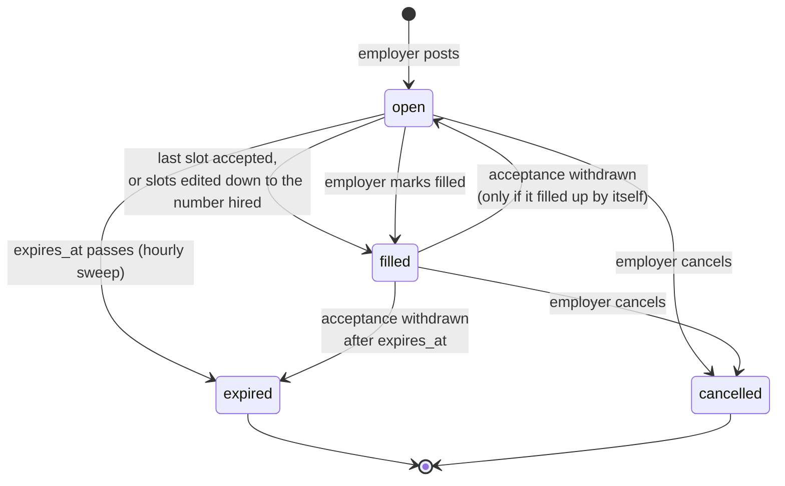
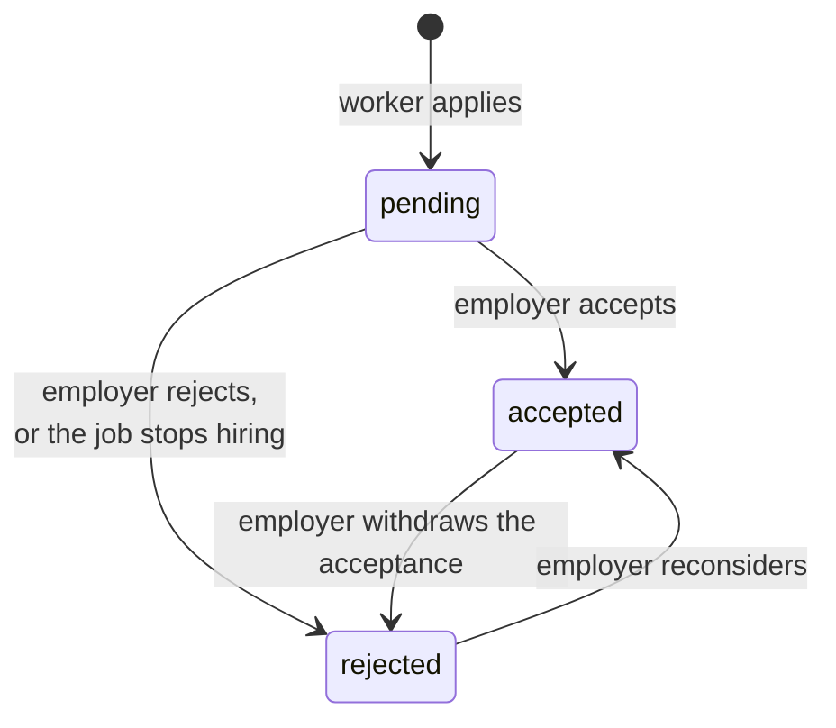

# Job lifecycle

How jobs and applications move between states, and what happens on each
move. The rules are implemented in
[`job-lifecycle.ts`](../apps/api/src/modules/jobs/job-lifecycle.ts); the
reasoning is in [ADR 0004](adr/0004-job-and-application-lifecycle.md).

## Job states



| State       | On the map | Takes applications | Employer can                             |
| ----------- | ---------- | ------------------ | ---------------------------------------- |
| `open`      | yes¹       | yes¹               | edit, accept/reject, mark filled, cancel |
| `filled`    | no         | no                 | reject / withdraw acceptances, cancel    |
| `expired`   | no         | no                 | reject / withdraw acceptances            |
| `cancelled` | no         | no                 | nothing                                  |

¹ While `expires_at` is in the future and a slot is free.

### Filled by hand vs. filled up

Both are `filled`, and the headcount tells them apart:

- `filled_slots = slots`: **filled up**. Withdrawing an acceptance frees a
  slot, and the job goes back to `open` (or `expired`, if its window has
  passed).
- `filled_slots < slots`: **closed by the employer**. It stays `filled`
  whatever happens to acceptances. No further acceptances are allowed, so
  nothing can move it back.

### Expiry

```
expires_at = max(created_at + 7 days, start_time)
```

A posting stays up for at least a week after it was posted, and until its
start time if that is later. Editing the start time recomputes this from
`created_at`, so edits never extend a posting beyond that rule. Start times
must be in the future, both when posting and when editing.

The map query filters on `expires_at` directly, so a job leaves the map on
time. The hourly sweep then sets `status = 'expired'` so the employer's list
is honest, and closes the job's pending applications.

## Application states



- **Accepting** takes a slot. It needs the job to be `open`, unexpired and
  not full. Otherwise it fails with **409** if the job is full, or **400** if
  it is closed.
- **Withdrawing** an acceptance frees the slot. See "Filled by hand vs.
  filled up" above for whether the job reopens.
- **When a job stops hiring**, whether filled (any way), cancelled or
  expired, every `pending` application on it becomes `rejected`, and each
  of those workers is notified with the reason.
- **Cancelling** also notifies hired workers. Their applications stay
  `accepted` as the record of who was hired.
- Contact details are shared only while an application is `accepted`
  ([ADR 0006](adr/0006-contact-details-as-v1-payment-channel.md)).

## Side effects at a glance

| Event                                | Job                   | Applications                   | Pushes                                                                      |
| ------------------------------------ | --------------------- | ------------------------------ | --------------------------------------------------------------------------- |
| Worker applies                       | —                     | new `pending`                  | employer: `application.created`                                             |
| Employer accepts                     | `filled` if last slot | pending → `rejected` if filled | worker: `application.accepted`; others: `application.closed`                |
| Employer rejects / withdraws         | may reopen            | —                              | worker: `application.rejected`                                              |
| Employer edits `slots` down to hired | `filled`              | pending → `rejected`           | `application.closed`                                                        |
| Employer marks filled                | `filled`              | pending → `rejected`           | `application.closed`                                                        |
| Employer cancels                     | `cancelled`           | pending → `rejected`           | pending: `application.closed`; hired: `job.cancelled`                       |
| Hourly sweep                         | `expired`             | pending → `rejected`           | `application.closed`                                                        |
| Hourly 09:00–20:00 Zurich            | —                     | —                              | employer: `job.expiring`, once per job, when it leaves the map within a day |

Payloads are in [notifications.md](notifications.md).

## Concurrency

Every one of these changes runs in a transaction holding a row lock on the
job: `FOR UPDATE` for anything that changes status or headcount, and
`FOR SHARE` for applying. Racing acceptances, edits, cancellations and
applications are therefore serialised per job, and a closed job never keeps
a pending application. See [ADR 0005](adr/0005-row-locks-for-job-state-changes.md).
